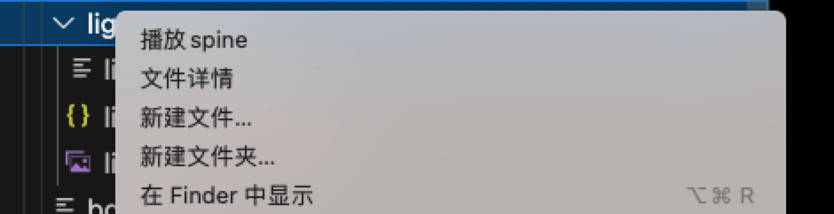

<!--
 * @Author: haobin.wang
 * @Date: 2025-03-28 18:31:22
 * @LastEditors: haobin.wang
 * @LastEditTime: 2025-04-18 09:34:39
 * @Description: Do not edit
-->
English | [简体中文](./README_zh_CN.md)  
# Spine Preview 

## Features

Spine File Preview: A Visual Studio Code extension based on pixi.js that allows you to preview Spine animations easily and efficiently.
## Requirements
- Visual Studio Code version 1.87.0 or higher.

## Extension Settings

This extension contributes the following settings:

- `spine-preview.enable`: Enable/disable the Spine Preview extension.
- `spine-preview.autoReload`: Automatically reload the preview when the file changes.

## Known Issues
Support pixi.js version user-controlled switching playback

## Release Notes

### 1.0.0
Initial release of Spine Preview with the following features:

- Preview Spine files directly within Visual Studio Code.
- Support viewing animation information
- Step
- Right-click the folder containing .json, .atlas, .png (the files need to have the same name), then click [Play Spine]

## Following extension guidelines

## Working with Markdown

## For more information

## Contact Information

For any inquiries or support, please contact:

- Email: 1159472304@qq.com
- GitHub Issues: [Submit an Issue](https://github.com/lantianhaijiao)

## Contributors
- [lantianhaijiao](https://github.com/lantianhaijiao)
- [main2018](https://github.com/main2018)

## License

[MIT](https://opensource.org/licenses/MIT)

Copyright (c) 2025-present, haobin.wang

**Enjoy!**
