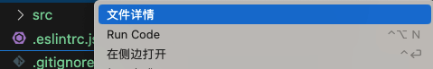
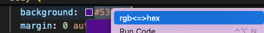

# boast README

彩虹屁和一些小功能

## Features

- cmd+shift+k: 执行夸夸
- 去掉console选中代码，执行快捷键cmd+shift+r
- 右键查看文件详情
- 选中文本后右键 实现 rgb<=>hex互相转换

  
## Requirements

## Extension Settings

Include if your extension adds any VS Code settings through the `contributes.configuration` extension point.

For example:

This extension contributes the following settings:

* `myExtension.enable`: Enable/disable this extension.
* `myExtension.thing`: Set to `blah` to do something.

## Known Issues

## Release Notes

Users appreciate release notes as you update your extension.

### 0.0.2

增加右键【文件详情】
增加选中颜色后，右键【rbg<=>hex】格式互换

### 0.0.1

增加夸夸和【去掉console.xxx】

---

## Following extension guidelines

Ensure that you've read through the extensions guidelines and follow the best practices for creating your extension.

* [Extension Guidelines](https://code.visualstudio.com/api/references/extension-guidelines)

## Working with Markdown

## For more information

**Enjoy!**
